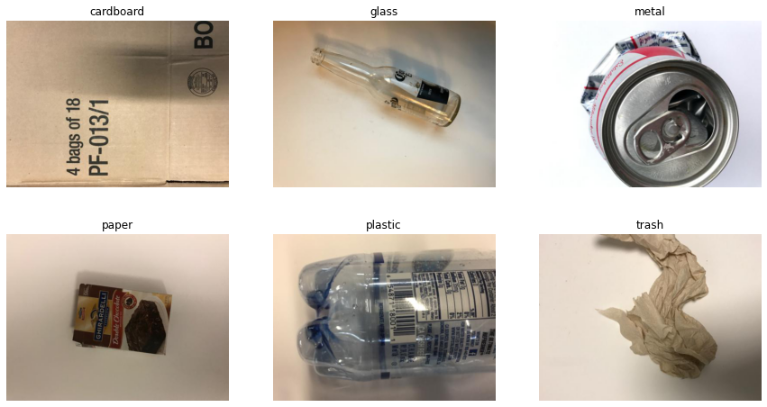
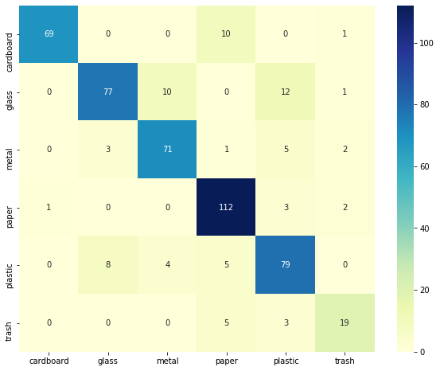

This project is trying to classify trash images into five trash categories:
* paper
* cardboard
* plastic
* metal
* trash

I started from training a model from scratch, but my model accuracy were always around 0.3-0.5. Then I switched to leverage transfer learning, and I tried both MobileNet and VGG16.

My based model was trained by using MobileNet, I froze pre-trained convolutional layers in the model and turned off the last layer. This base model returned an accuracy score of 68%.

Then I tried to augment more image data in my training dataset, also rescaled the pixel values to the range of [0,1].

Now the model which generates the best result is a MobileNet model, with accuracy: 0.85

<<<<<<< HEAD

=======

>>>>>>> 1c291999ed3dae4fcfa68fde33f12f9ba4830eac
