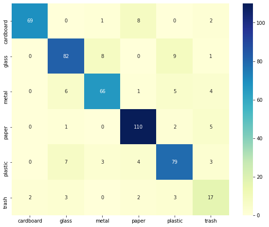

# Deep Learning: Trash Classification With Neural Networks
Wenting Deng

## Abstract
As more cities in China start to promote some mandatory but complex trash sorting rules, which create challenges among their residents to transition from disposing trash freely to one of the strictest waste-sorting regulations in the world in this short time period. A system which could recognize the trash classes would be helpful for people to sort their household trash more efficiently. Therefore, the goal of this project is to train a Convolutional Neural Networks for trash photo classification. The data I worked with came from [Kaggle](https://www.kaggle.com/asdasdasasdas/garbage-classification). It contains 2,600 sample images with 6 classifications: cardboard, glass, metal, paper, plastic and trash. The final model was trained by leverage transfer learnings based on VGG16.

## Design
This Convolutional Neural Networks can be further used to create an AI Camera app, which could be used to recognize the trash types automatically. This types of app can be launched as a subscription based app for enterprise users, and for individual users we can launch it for free.

## Data
The data I worked with came from [Kaggle](https://www.kaggle.com/asdasdasasdas/garbage-classification). It contains 2,600 sample images with 6 classifications: cardboard (393), glass (491), metal (400), paper(584), plastic (472) and trash(127). This dataset is imbalanced as trash images only account for 5% in total.

## Algorithms
**CNN**
I trained a CNN model from scratch as my base model, but because it performed poorly with only 30% - 40% accuracy, I switched to leverage transfer learnings.

**Transfer Learnings**
For photo transformation, I applied photo augment to expand my training data.
I tested MobileNet, Inception and VGG16 on the new training data. And I ended up choosing VGG16 as my final model based on accuracy scores.

In this VGG16 model, I froze all pre-trained convolutional layers and created 2 additional hidden layers, also I added drop out layers after each dense layer to prevent overfittings. The outputs from each dense layer was normalized. And the model achieved an accuracy of 88% on training data and 82.6% on testing data

**Model Test**
The final model was tested on validation data to get the top1 accuracy score and top3 accuracy score:

top1 validation accuracy: 84.1%\
top3 validation accuracy: 98%

**Tools**
* Numpy and Pandas for data manipulation
* keras to build the CNN and fully connected layers
* Google Colaboratory for model training

## Communication##
Slides. I will further update this project and add it to blog after the bootcamp.
